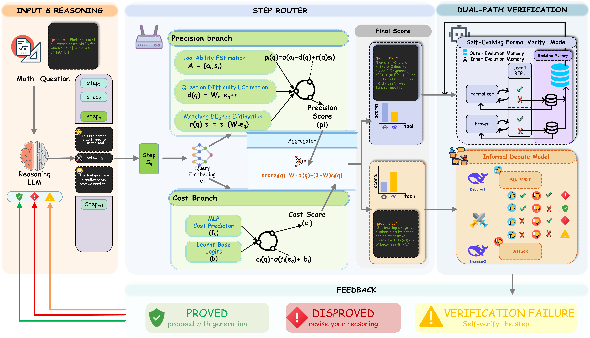

# FIVER: Adaptive Fusion of Formal and Informal Verification for Mathematical Reasoning in LLMs

> Accepted to **Findings of EMNLP 2026**.

Official implementation of **FIVER** (**F**ormal--**I**nformal **V**erification Agent with **E**fficient **R**outing), a step-level mathematical verification agent that adaptively routes reasoning steps to either a formal Lean 4 workflow or an informal debate workflow.

**Yujie Li\***, **Ao Xu\*†**, **Ziyou Guo**, **Tieru Wu†**<br>
\* Equal contribution. † Corresponding authors.

## Overview

Formal and informal verification have complementary strengths. Formal verification produces transparent, machine-checkable proof objects, but can be expensive and brittle. Informal verification is cheaper and broadly applicable, but cannot by itself provide rigorous proof certificates. FIVER learns which workflow better fits each reasoning step while accounting for both verification success and invocation cost.

<p align="center">
  
</p>

FIVER contains four main modules:

- **Input & Reasoning:** a reasoning LLM generates a solution and issues workflow-agnostic verification requests for critical steps.
- **Step Router:** an item-response-theory-inspired router combines a precision branch with a latency-cost branch to select a verifier.
- **Dual-Path Verification:** the formal path uses Lean 4 with Evolution Memory, while the informal path uses complementary support and attack views.
- **Feedback:** the verifier returns `PROVED`, `DISPROVED`, or `VERIFICATION FAILURE` to guide subsequent reasoning.

## Highlights

- Adaptive step-level fusion of formal and informal verification.
- Multi-objective routing that models step--tool fit, verification success, and invocation cost.
- A self-evolving formal verifier that reuses successful proofs and records failed attempts as negative guidance.
- Debate-style informal verification with support, attack, and aggregation stages.
- Best accuracy in all 16 model--benchmark settings in the main evaluation.
- Under Qwen3-8B, FIVER uses only **58.8%** of HERMES's verification tokens on average.

## Main Results

Accuracy on four mathematical reasoning benchmarks (%). Reasoning-model outputs use an 8192-token budget. FIVER and HERMES are evaluated at @1; Majority@5 and the reward-model baselines use five sampled trajectories.

| Reasoning model | Method | MATH-398 | MinervaMath | AIME 2025 | HM2 |
|---|---|---:|---:|---:|---:|
| Qwen3-8B | Zero-shot | 75.37 | 47.06 | 10.00 | 0.47 |
|  | Majority@5 | 77.89 | 64.34 | 23.33 | 1.57 |
|  | Skywork-V2 | 81.40 | 66.18 | 30.00 | 5.21 |
|  | GenPRM | 80.15 | 62.50 | 23.33 | 3.79 |
|  | HERMES | 79.84 | 67.27 | 30.00 | 2.84 |
|  | **FIVER** | **88.44** | **69.85** | **40.00** | **6.64** |
| Qwen3.5-35B | Zero-shot | 94.47 | 73.53 | 66.67 | 36.97 |
|  | Majority@5 | 94.97 | 76.84 | 73.33 | 39.34 |
|  | Skywork-V2 | 94.22 | 75.00 | 73.33 | 45.97 |
|  | GenPRM | 93.47 | 75.74 | 70.00 | 44.45 |
|  | HERMES | 94.47 | 76.84 | 70.00 | 38.38 |
|  | **FIVER** | **95.47** | **79.04** | **83.33** | **47.87** |
| Qwen3.5-122B | Zero-shot | 94.22 | 72.79 | 60.00 | 44.54 |
|  | Majority@5 | 95.23 | 72.79 | 60.00 | 45.02 |
|  | Skywork-V2 | 96.98 | 72.79 | 66.67 | 46.45 |
|  | GenPRM | 94.47 | 70.22 | 66.67 | 49.76 |
|  | HERMES | 94.72 | 70.59 | 60.00 | 46.45 |
|  | **FIVER** | **97.49** | **75.37** | **70.00** | **51.66** |
| DeepSeek-V4-Flash | Zero-shot | 96.73 | 85.29 | 53.33 | 64.45 |
|  | Majority@5 | 98.24 | 86.76 | 63.33 | 65.40 |
|  | Skywork-V2 | 98.25 | 86.76 | 66.67 | 66.35 |
|  | GenPRM | 97.49 | 84.93 | 63.33 | 68.72 |
|  | HERMES | 96.73 | 85.29 | 60.00 | 63.03 |
|  | **FIVER** | **98.74** | **88.60** | **70.00** | **70.14** |

## Installation

```bash
pip install -r requirements.txt
```

FIVER uses OpenAI-compatible endpoints for the reasoning, embedding, and verification models. Keep credentials outside version control and pass them through the command-line arguments or the corresponding environment-variable options.

## Train the Router

The released step-level annotations and router training records are located at:

```text
data/router_training/fiver_step_annotations.json
data/router_training/fiver_router_training.jsonl
```

Train the precision and cost branches with:

```bash
python train_router.py \
  --train-jsonl data/router_training/fiver_router_training.jsonl \
  --output-checkpoint <router_checkpoint_path> \
  --tool-names lean4,deepseek \
  --val-ratio <validation_ratio> \
  --device <cpu_or_cuda_or_auto> \
  --embedding-base-url <router_embedding_base_url> \
  --embedding-api-key <router_embedding_api_key> \
  --embedding-model <router_embedding_model> \
  --specialty-dim <specialty_dim> \
  --cost-hidden-dim <cost_hidden_dim> \
  --router-difficulty-epsilon <difficulty_epsilon> \
  --epochs <num_epochs> \
  --success-lr <success_learning_rate> \
  --cost-lr <cost_learning_rate> \
  --batch-size <batch_size> \
  --weight-performance <router_weight>
```

This produces the router checkpoint at `<router_checkpoint_path>` and a metadata JSON file next to it.

## Run FIVER

Run FIVER on a single problem:

```bash
python run_problem.py \
  --problem "Convert the point $(0,3)$ to polar coordinates." \
  --outer-base-url <outer_base_url> \
  --outer-api-key <outer_api_key> \
  --outer-model <outer_model> \
  --embedding-base-url <router_embedding_base_url> \
  --embedding-api-key <router_embedding_api_key> \
  --embedding-model <router_embedding_model> \
  --memory-embedding-base-url <memory_embedding_base_url> \
  --memory-embedding-api-key <memory_embedding_api_key> \
  --memory-embedding-model <memory_embedding_model> \
  --router-model-path <router_checkpoint_path> \
  --weight-performance <router_weight> \
  --router-difficulty-epsilon <difficulty_epsilon> \
  --max-steps <max_steps> \
  --memory-top-k <memory_top_k> \
  --deepseek-verifier-attempts <deepseek_verifier_attempts> \
  --deepseek-base-url <deepseek_base_url> \
  --deepseek-api-key <deepseek_api_key> \
  --deepseek-model <deepseek_model> \
  --lean-formalizer-base-url <lean_formalizer_base_url> \
  --lean-formalizer-api-key <lean_formalizer_api_key> \
  --lean-formalizer-model <lean_formalizer_model> \
  --lean-backtranslate-base-url <lean_backtranslate_base_url> \
  --lean-backtranslate-api-key <lean_backtranslate_api_key> \
  --lean-backtranslate-model <lean_backtranslate_model> \
  --lean-prover-base-url <lean_prover_base_url> \
  --lean-prover-api-key <lean_prover_api_key> \
  --lean-prover-model <lean_prover_model> \
  --lean-repl <lean_repl_path> \
  --lean-lake-path <lean_lake_path> \
  --lean-project-root <lean_project_root> \
  --lean-repl-timeout-s <lean_repl_timeout_seconds> \
  --lean-translator-attempts <lean_translator_attempts> \
  --lean-prover-attempts <lean_prover_attempts> \
  --lean-inner-memory-top-k <lean_inner_memory_top_k> \
  --lean-outer-memory-top-k <lean_outer_memory_top_k>
```

For dataset evaluation, use JSON, JSONL, or Arrow input:

```bash
python run_problem.py \
  --input-arrow <dataset_arrow_path> \
  --problem-key <problem_field> \
  --answer-key <answer_field> \
  --index-key <index_field> \
  --output-jsonl <output_jsonl_path> \
  [the runtime arguments above]
```

## Repository Structure

```text
FIVER/
├── math_router/
│   ├── router.py              # Adaptive verifier selection
│   ├── router_nnmodel.py      # Precision and cost models
│   ├── reason.py              # Reasoning and feedback loop
│   ├── verifiers/             # Lean 4 and informal debate workflows
│   └── training/              # Router data, embeddings, and training
├── prompts/                   # Reasoning and verification prompts
├── data/
│   ├── router_training/       # Released router supervision data
│   └── datasets/              # Evaluation datasets
├── train_router.py
└── run_problem.py
```

## Citation

```bibtex
@inproceedings{li2026fiver,
  title     = {FIVER: Adaptive Fusion of Formal and Informal Verification for Mathematical Reasoning in LLMs},
  author    = {Li, Yujie and Xu, Ao and Guo, Ziyou and Wu, Tieru},
  booktitle = {Findings of the Association for Computational Linguistics: EMNLP 2026},
  year      = {2026}
}
```

The citation will be updated with the official ACL Anthology metadata after publication.

## Contact

For questions about the paper or code, please open a GitHub issue or contact the corresponding authors.
